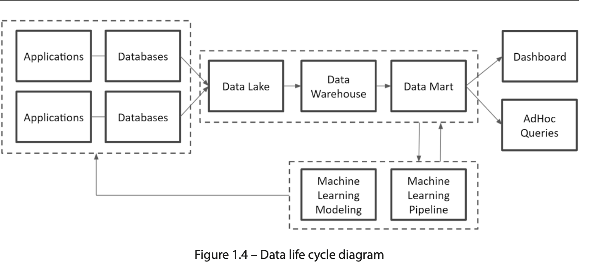
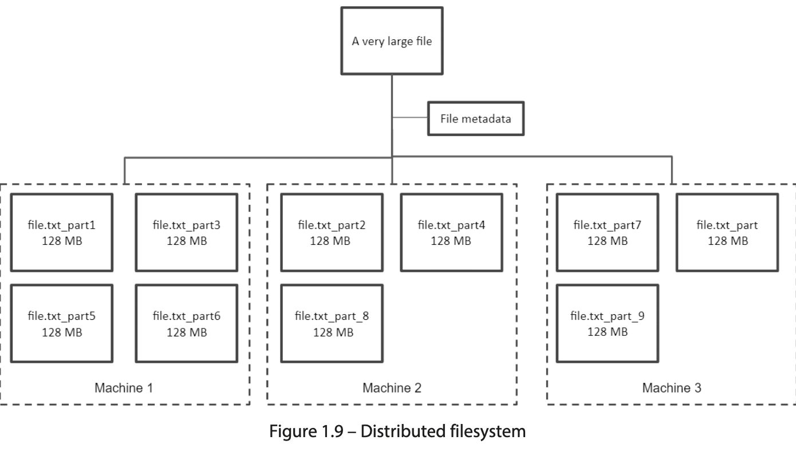
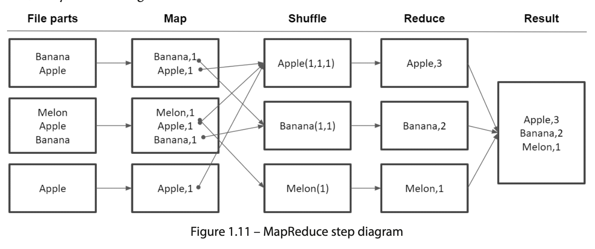

# GCP Professional Data Engineering \- Notes

## Chapter 1: Fundamentals of Data Engineering

**Why Data Engineering**: Clean data doesn’t just exist and all the data needed for the business is not stored in one central repository in one uniform format. Solve data silos \+ bring data to light.

**Data Lifecycle**: The life of data from source system to destination BI system/consumer.

**Data Warehouse**: Refers to the system/tool that can enable data to be ingested and interacted with. It consists of the following components as one combined toolset. e.g BigQuery, Snowflake

* Storage (ingest)  
* Compute (to process transformations and queries)  
* Schema (description of the data format/layout)  
* Query Interface (UI/tooling to interact with the data)

**Data Lake**: Refers to the system or set of systems that allow both structured or unstructured data to be ingested, stored, governed and interacted with. It can contain one or more components of a Data Warehouse. e.g Google Cloud Storage, Apache Iceberg

* Storage (structured \+ unstructured data dump)  
* Compute or no compute  
* Scheduling Tools  
* Governance Tools  
* Schema or no schema  
* Tooling to interact with data (SQL/UI)

**Data Mart**: Refers to “business group specific” transformed dataset that is ready to be consumed via a BI layer.  For Appteam: this is a dataset in BQ that is named accordingly \- transformed & ready.

**Big Data**: Data that is bigger than its destination system and requires special handling to store and access.

The five Vs of data: _volume_, _variety_, _velocity_, _veracity_, and _value_.

**Distributed File System**: A solution for Big Data storage for data that doens't easily fit in a reasonable storage device in one server. e.g 1PB of data in a 10TB server. Hadoop is an opensource solution that enables a distributed file storage.

**MapReduce**: A solution/algorithm that allows accessing data stored in a DFS. e.g BigQuery processes data in a distributed manner when we run a query on a PB of data.

    Map->Shuffle->Reduce->Result. 

**Current Data Tech Stack**

* Data Lake: GCS   
* Data Warehouse: BQ  
* Data Mart: BQ  
* BI Layer: Tableau (Looker)  
* Extract+Load: Airbyte (load data to the Lake)  
* Transformation: dbt  
* Legacy Data Extraction \+ transformation: API calls with Mulesoft \-\> loads to the lake  
* Data Transfer Service: Loads Extracted or Extracted \+ Transformed Data to BQ

**ETL or ELT? :** Both have their pros and cons and we may need one or the other depending on the business/compliance requirements. However, currently I work on pipeline paradigm that is heavily tilted towards the ELT. 

* Dump everything without any transformation into Google Cloud Storage buckets  
* Use scheduled data transfer service in BQ to ingest ready-to-import data (JSON, CSV, PARQUET, etc.)
* Use dbt to create data marts based on existing warehouse tables
* Create VCs and extracted data sources to expose the data marts in Tableau

**Data Roles/Functions**:

* Business Analyst  
* Data Architect  
* Data Integrations Engineer  
* Data Engineer  
* Analytics Engineer  
* Data Infrastructure Engineer  
* ML Engineer  
* Data Manager  
* Data Scientist  
* Data Visualization/BI Engineer